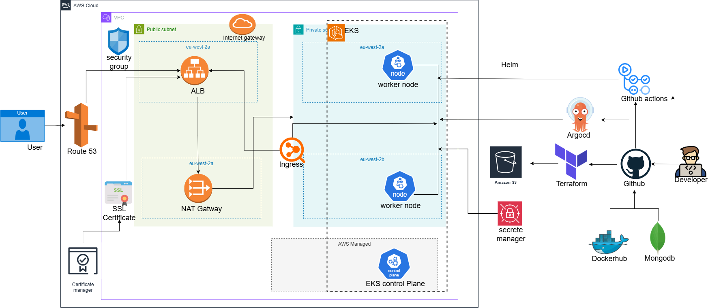

> A production-grade, cloud-native study collaboration platform demonstrating enterprise DevOps practices, microservices architecture, and modern infrastructure automation.

## 🎯 Overview

StudySync is part of my Masters Dissertation of a **real-time collaborative study platform** built with a focus on **DevOps excellence, cloud-native architecture, and production-grade reliability**. This project demonstrates end-to-end implementation of modern DevOps practices, from infrastructure provisioning to automated deployments and comprehensive monitoring.

### Key Features

- ✅ Real-time collaboration with WebSocket support
- ✅ Microservices architecture (Backend API + Frontend SPA)
- ✅ Multi-environment deployments (Dev, Staging, Production)
- ✅ Zero-downtime deployments with Canary strategy
- ✅ Automated CI/CD with GitHub Actions
- ✅ GitOps workflow with ArgoCD
- ✅ Comprehensive monitoring with Prometheus & Grafana
- ✅ Infrastructure as Code with Terraform & Helm
- ✅ Container orchestration on Kubernetes (EKS)

---

## 🏗️ Architecture

### High-Level Architecture

🛠️ **Tech Stack**

**Infrastructure & Cloud**:
AWS (EKS, EC2, VPC, ALB, CloudWatch, Secrets Manager), Kubernetes 1.28+, Terraform, Helm, ArgoCD

**DevOps & Automation**:
GitHub Actions, Docker Hub, GitOps with ArgoCD, Autoscaling (HPA & Cluster Autoscaler), AWS VPC CNI, CoreDNS

**Security & Scanning**:
Trivy, Snyk

**Monitoring & Observability**:
Prometheus, Grafana, CloudWatch Logs & Container Insights, Fluent Bit, AWS X-Ray, Alertmanager (Slack Webhooks)

**Application Stack**:
Node.js (Express.js, Socket.io), Vue.js 3 (Vite, TailwindCSS), MongoDB Atlas, Nginx Ingress Controller

---

## 📊 Monitoring & Observability

### Prometheus Metrics

- **Application Metrics**: Request rate, latency, error rate (RED method)
- **Infrastructure Metrics**: CPU, memory, disk, network (USE method)
- **Custom Business Metrics**: Active users, study sessions, collaboration events

### Grafana Dashboards

- **Cluster Overview**: Node health, pod status, resource utilization
- **Application Performance**: Request throughput, response times, error rates
- **Database Metrics**: Query performance, connection pools
- **Cost Tracking**: Resource usage by namespace/

---

## 🔐 Security

Network Security:
VPC isolation (public/private subnets), least-privilege security groups, pod-to-pod network policies.

Container Security:
Trivy scans in CI, non-root containers, read-only filesystems, enforced resource limits.

Secrets Management:
AWS Secrets Manager, Secrets Store CSI Driver, no secrets in Git, automatic rotation.

Access Control:
IAM Roles for Service Accounts (IRSA), RBAC, Pod Security Standards, audit logging.

Compliance & Scanning:
Image signing, SAST/DAST, dependency scanning, automated security patching.
