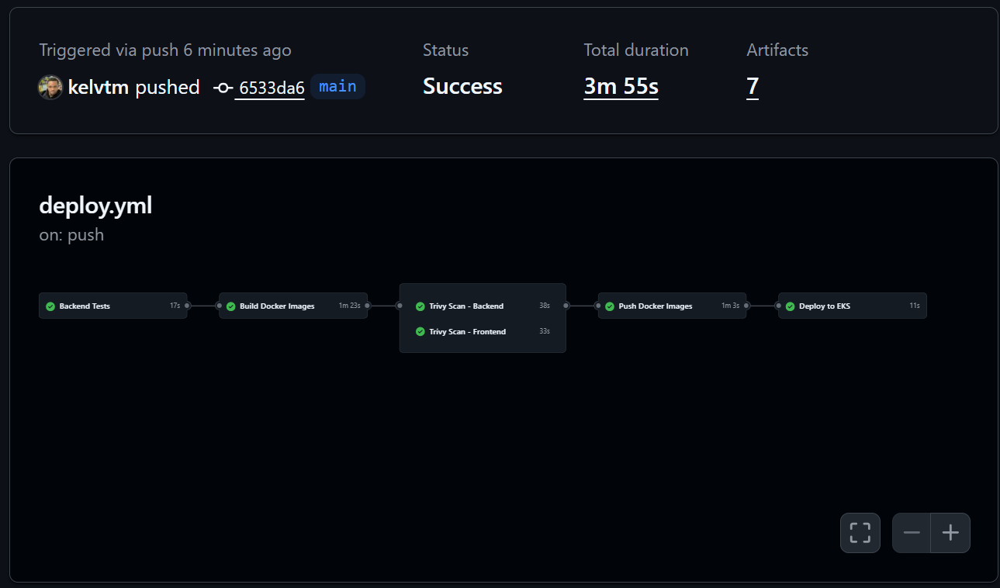
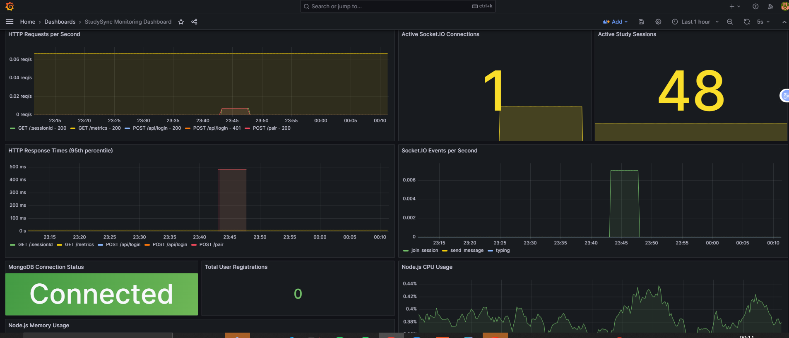

> A production-grade, cloud-native study collaboration platform demonstrating modern DevOps practices, scalable system design, and full-stack implementation.

---

## Overview

Study Sync is a real-time collaborative study platform developed as part of my Master’s dissertation, designed and implemented as a **production-oriented cloud-native system**. The project combines a complete full-stack web application with a strong emphasis on **reliability, automation, observability, and infrastructure-as-code**.

The platform applies Social Cognitive Theory to academic procrastination through peer-integrated features, while the technical implementation focuses on building, deploying, and operating a resilient distributed system using contemporary DevOps and platform engineering practices.

---

## Core Capabilities

- Real-time peer collaboration using WebSockets
- Microservices backend API and frontend SPA
- Containerised workloads deployed on Kubernetes (EKS)
- Multi-environment delivery pipeline (development, staging, production)
- Automated CI/CD with progressive delivery
- GitOps-based deployment management
- Comprehensive monitoring, logging, and alerting
- Secure secrets management and least-privilege access control

---

## Architecture

### System Architecture

The system is composed of a Vue.js single-page application, a Node.js/Express backend with Socket.io for real-time communication, and a managed MongoDB data store. Services are containerised and deployed to Kubernetes using Helm charts, with traffic managed via an NGINX Ingress Controller and AWS load balancing.

### Delivery Pipeline

The CI/CD pipeline performs automated testing, security scanning, image builds, and versioned deployments. ArgoCD continuously reconciles cluster state using a GitOps workflow, enabling controlled and repeatable releases.

### Observability

---

## Technology Stack

### Application

- **Frontend**: Vue.js 3, Vite, TailwindCSS
- **Backend**: Node.js, Express.js, Socket.io
- **Database**: MongoDB Atlas

### Container & Platform

- Docker
- Kubernetes (EKS)
- Helm
- NGINX Ingress Controller

### Infrastructure & Automation

- AWS (EKS, EC2, VPC, ALB, IAM, CloudWatch)
- Terraform (infrastructure provisioning)
- ArgoCD (GitOps deployment)
- GitHub Actions (CI/CD)

### Observability

- Prometheus
- Grafana
- Alertmanager
- Fluent Bit
- AWS CloudWatch & Container Insights

### Security

- Trivy and Snyk scanning
- IAM Roles for Service Accounts (IRSA)
- Kubernetes RBAC and Pod Security Standards
- Secrets Store CSI Driver with AWS Secrets Manager

---

## Monitoring and Observability

Monitoring is implemented using Prometheus and Grafana, capturing both infrastructure- and application-level metrics.

- **Infrastructure metrics**: CPU, memory, network, and pod health
- **Application metrics**: request throughput, latency, and error rates
- **Custom metrics**: active users, study sessions, and collaboration events

Alerting is configured via Alertmanager with external notifications, enabling rapid detection of system degradation.

---

## Security and Reliability

The platform follows a defence-in-depth approach:

- Network isolation using private VPC subnets and security groups
- Least-privilege IAM and Kubernetes RBAC
- Container hardening (non-root images, resource limits, read-only filesystems)
- Secrets managed externally with no sensitive data committed to source control
- Continuous vulnerability scanning integrated into the delivery pipeline

---

## Project Context

While developed in an academic setting, the system was intentionally designed, implemented, and operated using industry-aligned practices. Emphasis was placed on reproducibility, automation, and operational visibility, ensuring the platform behaves consistently across environments and under real-world conditions.

---

## License

This project is licensed under the MIT License.
